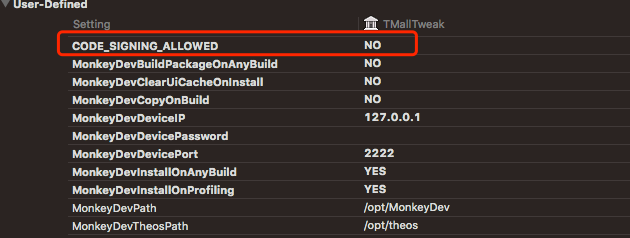
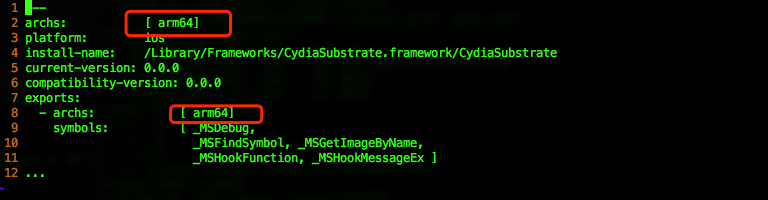

## 1. 不完美越狱

[checkra1n](https://checkra.in/releases/0.9.8-beta)只支持MacOS，连接上USB后，根据App提示，即可越狱。然后在iPhone上打开checkra1n App，安装Cydia即可。

我的手机为iPhone7 13.3.1

## 2. Cydia 安装OpenSSH

1. 在Cydia中搜索安装OpenSSH

2. 确保手机和电脑在同一局域网

   ```sh
   ssh -P 22 root@<iPhone局域网IP>
   # 默认密码为alpine
   ```

3. 设置免密连接

   [来源：MonkeyDev Wiki](https://github.com/AloneMonkey/MonkeyDev/wiki/安装)

   ```sh
   ssh-keygen -t rsa -P '' #如果已经有了id_rsa，跳过这一波
   ssh-copy-id -i /Users/username/.ssh/id_rsa root@ip #这里提示错误，添加sudo即可
   ```

<!-- more -->

## 3. USB连接手机

1. 安装usbmuxd

	```sh
    brew install usbmuxd 
   ```

2. 映射本地端口到手机ssh 22端口

   ```sh
   iproxy 2222 22 # 这里将本地的2222，映射到了通过USB连接的手机的22端口
   ```
   
3. ssh连接

   ```sh
   ssh -P 2222 root@localhost
   ```

## 4. 使用scp和手机进行文件传输

比如手机的局域网ip为 192.168.0.100

1. 拷贝iPhone文件到电脑

   ```sh
   scp -P 22 root@192.168.0.100:/Developer/usr/bin/debugserver ./debugserver
   ```

2. 拷贝电脑文件到iPhone

   ```sh
   scp -P 22 ./debugserver root@192.168.0.100:/usr/bin/debugserver
   ```

这里的命令都是当前mac中进行

## 4. 砸壳工具

[来源于](https://www.jianshu.com/p/aec0325aa2dc)

1. [Clutch](https://github.com/KJCracks/Clutch)

```sh
# mac
curl https://github.com/KJCracks/Clutch/releases/download/2.0.4/Clutch-2.0.4 -o ./Clutch
chmod +x Clutch
scp -P 22 ./Clutch root@ip:/usr/bin/Clutch
# iphone
Clutch -i #列出已经安装的App
Clutch -d <indexId>
```

2. [dumpdecrypted](https://github.com/KJCracks/Clutch)

```sh
# mac 
git clone https://github.com/stefanesser/dumpdecrypted.git
cd dumpdecrypted
make
scp -P 22 ./dumpdecrypted.dylib root@ip:/var/root/dumpdecrypted.dylib
# iphone
cd /var/root
ps -ef | grep <App名字> # 获取到App可执行文件的路径
DYLD_INSERT_LIBRARIES=dumpdecrypted.dylib <App可执行文件的路径>
# 然后在/var/root/下生成AppName.decrypted文件，这个文件就可以被Hopper的等软件正常使用了。
```

## 5. 安装Cycript

打开Cydia，搜索Cycript安装即可

## 6.Reveal查看视图层级

[来源于](https://www.jianshu.com/p/6cac1052879d)

1. mac上安装[Reveal 4](https://pan.baidu.com/s/1lz9lwTKXD9bS8DnvT9gkBQ)--提取密码:b31u

2. Cydia中, 下载Reveal2Loader

最后一步:

```sh
# mac
scp -r -P 22 /Applications/Reveal.app/Contents/SharedSupport/iOS-Libraries/RevealServer.framework/RevealServer root@YourIPhoneIP:/Library/MobileSubstrate/DynamicLibraries/reveal2Loader.dylib
```

最后一步:

打开设置 -> 找到Reveal -> 开启你需要查看的App

## 7.DebugServer

主要参考[iOS 逆向指南：动态分析](https://juejin.im/post/6844903889498537997#heading-3)

尝试过很多次，都有问题。最终解决办法。

1. 先将debugserver从iPhone拷贝到mac

   ```sh
   scp root@iOSDeviceIP:/Developer/usr/bin/debugserver ~/debugserver
   ```

2. 瘦身

   ```sh
   lipo -thin arm64 ~/debugserver -output ~/debugserver
   ```

3. 给 debugserver 添加 task_for_pid 权限，保存以下内容为 ent.xml 文件

   ```xml
   <!DOCTYPE plist PUBLIC "-//Apple//DTD PLIST 1.0//EN" "http://www.apple.com/DTDs/PropertyList-1.0.dtd">
   <plist version="1.0">
   <dict>
           <key>com.apple.springboard.debugapplications</key>
           <true/>
           <key>get-task-allow</key>
           <true/>
           <key>task_for_pid-allow</key>
           <true/>
           <key>run-unsigned-code</key>
           <true/>
   </dict>
   </plist>
   ```

   然后执行以下命令添加权限：`ldid -Sent.xml debugserver`
   
4. 给 debugserver 重新签名，保存以下内容为 entitlements.plist 文件:

   ```xml
   <?xml version="1.0" encoding="UTF-8"?>
   <!DOCTYPE plist PUBLIC "-//Apple//DTD PLIST 1.0//EN" "http://www.apple.com/DTDs/ PropertyList-1.0.dtd">
   <plist version="1.0">
   <dict>
   <key>com.apple.springboard.debugapplications</key>
      <true/>
      <key>run-unsigned-code</key>
      <true/>
      <key>get-task-allow</key>
      <true/>
      <key>task_for_pid-allow</key>
      <true/>
   </dict> 
   </plist>
   ```

   然后运行以下命令给的 debugserver 签名：`codesign -s - --entitlements entitlements.plist -f debugserver`

5. 先移除iPhone中的debugserver `rm /usr/bin/debugserver`

6. 重新拷贝 debugserver 回手机中：`scp ~/debugserver root@iOSDeviceIP:/usr/bin/debugserver`

7. 第一次使用 debugserver 时需要为其添加可执行权限：`chmod +x /usr/bin/debugserver`

8. iPhone运行debugserver `debugserver localhost:1234 /var/containers/Bundle/Application/4C579789-9197-4BDA-B3A8-8AC70CCB43F2/Xitu.app/Xitu` 

9. Mac `iproxy 1234 1234`

10. Mac `lldb`

11. Mac `process connect connect://localhost:1234`
```sh
# 还有一种，比如我的手机ip 192.168.0.100 Mac IP: 192.168.0.108
# iPhone
debugserver 192.168.0.108:1234 /var/containers/Bundle/Application/4C579789-9197-4BDA-B3A8-8AC70CCB43F2/Xitu.app/Xitu`
# Mac
lldb
process connect connect://192.168.0.100:1234
```


## 8. MonkeyDev运行问题

1. 提示错误**An empty identity is not valid when signing a binary for the product type 'Dynamic Library'.**
`Build Setting` 中 **添加**  `CODE_SIGNING_ALLOWED` 等于 `NO`

2. 提示错误**building for iOS, but linking in .tbd file (/opt/theos/vendor/lib/CydiaSubstrate.framework/CydiaSubstrate.tbd) built for iOS Simulator, file '/opt/theos/vendor/lib/CydiaSubstrate.framework/CydiaSubstrate.tbd' for architecture arm64**

    `sudo vim /opt/theos/vendor/lib/CydiaSubstrate.framework/CydiaSubstrate.tbd`
    
    将`archs`修改为只有 `arm64`
   